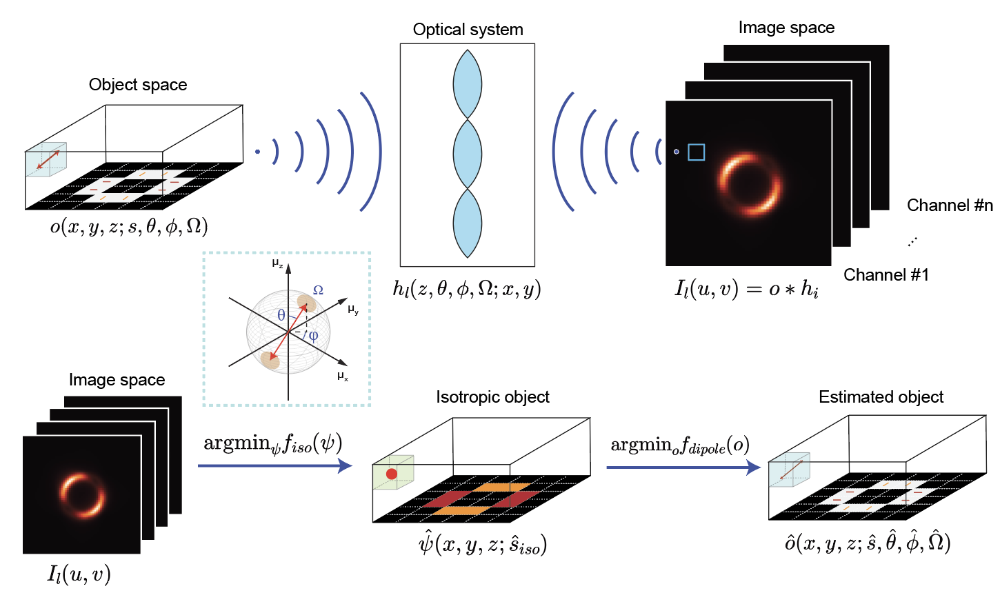
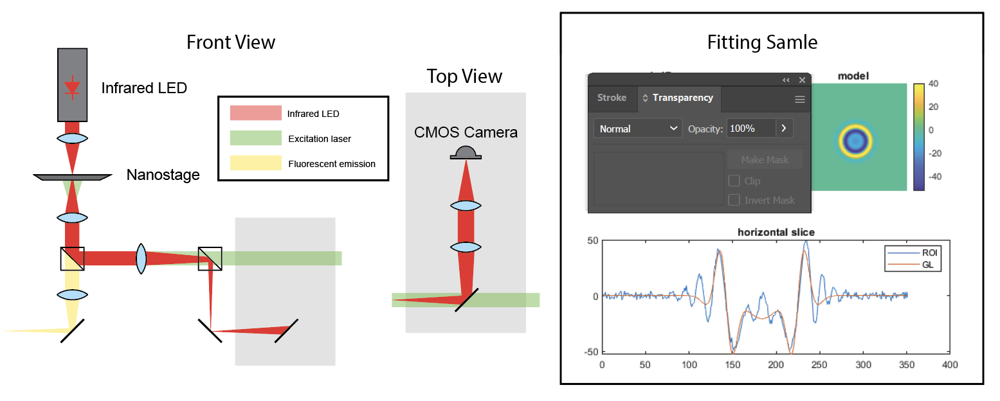
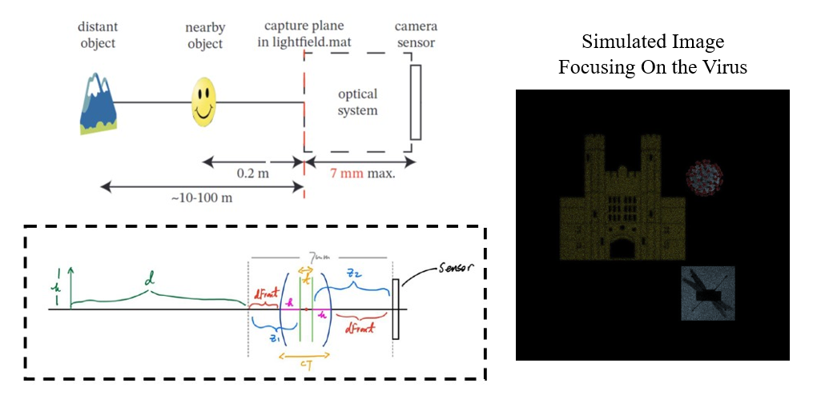
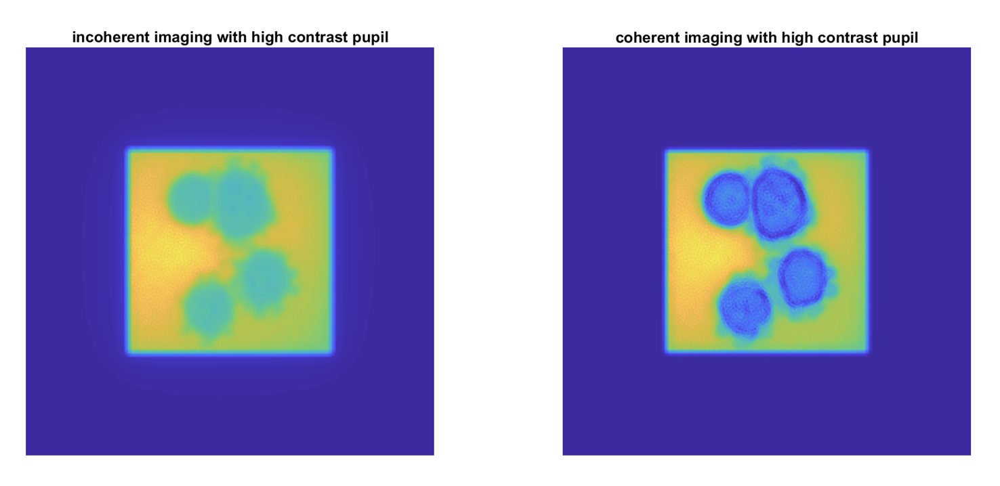
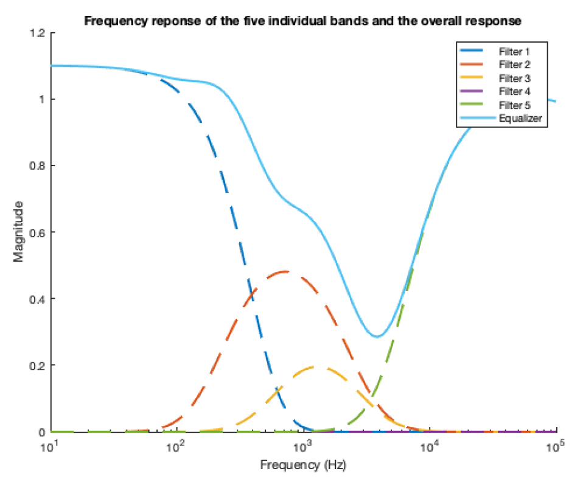

## Robust 6D Video-rate Fluorescence Microscopy (IP)

Honor Thesis Supervisor: [Prof. Matthew Lew](https://engineering.wustl.edu/faculty/Matthew-Lew.html)

  

I developed a computationally efficient signal processing method to reconstruct the 6D infomation - 3D localization $\langle x,y,z\rangle$ and 3D orientation $\langle \theta,\phi,\Omega \rangle$ - of biological samples through fluorescence microscope. 

This method is robust and fast to solve a high-dimensional inverse problem through one frame shot of the target object. Currently, I am conducting cell imaging experiments to demonstrate the system. Detailed infomation is listed in the [Poster](https://osf.io/6ce3t). 

## Portable OCT Sample Arm Design (IP)

Supervisor: [Prof. Chao Zhou](https://engineering.wustl.edu/faculty/Chao-Zhou.html)

I took part in the sample arm prototype design for handheld optical coherence tomography (OCT), collaborating with members at [Z-Lab](https://zlab.wustl.edu/). Currently, we are designing the optical path using Thorlabs commertial lenses. In the near future, we will customize the lenses, including the achromatic doublets and aspherical lenses, and the optomechanical mounts to further optimize the performance.

## An Active Stabilizing Feedback Module for Long-Term Super-Resolution Microscopy

Supervisor: [Prof. Matthew Lew](https://engineering.wustl.edu/faculty/Matthew-Lew.html)

  

Super-resolution microscopes are able to detect nano-stage drift beyond the diffraction limit, thus leading to a distortion in the image. In this project, an additional IR light path was added to the fluorescence microscope serving as the drift correction channel. I designed a model, based on Laguerre-Guassian (LG) modes, that was able to detect the drift on molecular scale, with a lateral precision within 1 nm and axial precision within 4 nm. 

## Camera Optical Path Design

  

I designed an optical imaging system, the total length of which is less than 7 mm, using off-the-shelf lenses for focusing images onto a digital CMOS camera sensor. I used the thick lens model, implemented the system into MATLAB, and simulated the camera using virtual light rays. I used the system to produce in-focus images for multiple objects at various distances, and then estimated the distance of the object based on my setup.

## High-contrast Optical Phase Mask Design

  

I designed computational phase mask for high-contrast imaging of a transparent hypothetical virus particle. I implement interferometry within the phase mask for a 4f system to improve contrast in the final image. I imaged the hypothetical object with both coherent light and incoherent light.

## High-Order Frequency-Selective Filters in Audio Equalizer

  

In this project, a system consisting of 5 frequency selective-filters with different predetermined settings is used to process audio signals. The main idea of the system is to sift out different frequency bands of a signal via RC filters and scale them with preset weights, and the final output signals are a combination of these modified bands. The equalizers with different presets introduced in this paper are designed to achieve various goals, such as bass/treble enhancement and siren attenuation, by enhancing or decreasing signals at different frequency bands. The figure is a designed equalizer for enhancing the audio for lecture recording.

## Pulse Shapes Analysis for Digital Communication

Two pulses with different pulse shapes were used to study the relationship between the pulse shape of the carrier frequency and the behaviour of the modulation. A pulse amplitude modulation (PAM) system was encapsulated into a function to process different data including text, audio and image.