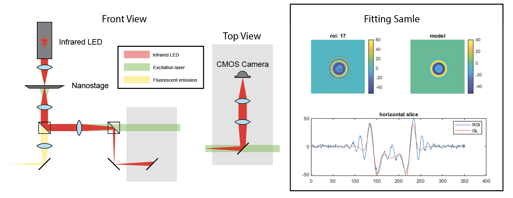

## Honor Thesis: Robust 6D Video-rate Fluorescence Microscopy (IP)

Supervisor: [Prof. Matthew Lew](https://engineering.wustl.edu/faculty/Matthew-Lew.html)

  

I developed a computationally efficient signal processing method to reconstruct the 6D infomation - 3D localization $\langle x,y,z\rangle$ and 3D orientation $\langle \theta,\phi,\Omega \rangle$ - of biological samples through fluorescence microscope. 

This method is robust and fast to solve a high-dimensional inverse problem through one frame shot of the target object. Currently, I am conducting cell imaging experiments to demonstrate the system. Detailed infomation is listed in the [Poster](https://osf.io/6ce3t). 

## Portable OCT Sample Arm Design (IP)

Supervisor: [Prof. Chao Zhou](https://engineering.wustl.edu/faculty/Chao-Zhou.html)

I take part in the sample arm prototype design for handheld OCT, collaborating with members at [Z-Lab](https://zlab.wustl.edu/). Currently, we are designing the optical path using Thorlabs commertial lenses. In the near future, we will customize the lenses, including the achromatic doublets and aspherical lenses, ourself to optimize the performance.

## An Active Stabilizing Feedback Module for Long-Term Super-Resolution Microscopy

Supervisor: [Prof. Matthew Lew](https://engineering.wustl.edu/faculty/Matthew-Lew.html)

  

Super-resolution microscopes are able to detect nano-stage drift beyond the diffraction limit, thus leading to a distortion in the image. In this project, I designed a model, based on Laguerre-Guassian (LG) modes, that was able to detect the drift on molecular scale, with a lateral precision within 1 nm and axial precision within 4 nm. 

## Camera Optical Path Design

  

I designed and simulated an optical imaging system, whose total length is less than 7 mm, using off-the-shelf lenses for focusing images onto a digital CMOS camera sensor. I used the system to produce in focus images for multiple objects at various distances, and then estimated the distance of the object based on my setup.

## Optical Phase Mask Design

